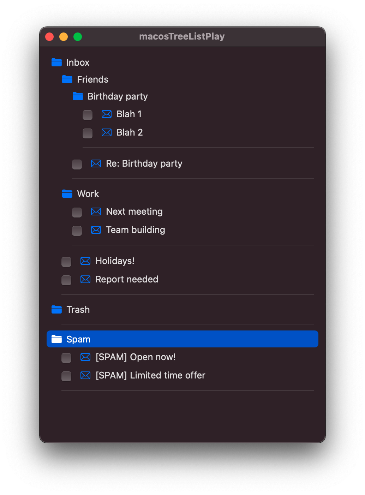

##  Intro

This is a demo project of a limited workaround to create a drag and drop editable, tree like list view using 100% current SwiftUI components on macOS.

*Why*

As of macOS 12.0.1 & Xcode 13.1, with the standard shipped `List` View it is possible to have it render **either**:

- A flat, non-hierarchical `List` that has movable items within it. 

**Or** 

- A hierarchical tree `List` but with unmovable items.

**But not both**.

On macOS, this type of tree view is a convenient and widely used UI paradigm e.g. Finder's View -> 'as List' view. Consequently, its absence from SwiftUI limits, at least in the short-term, SwiftUI's utility for developing macOS applications.

This project demonstrates one approach to working around this limitation using the existing SwiftUI components until (hopefully) Apple adds the missing "movable items in tree views" functionality to the built-in `List` component. 

## Building, running and testing

The project's been built using Xcode 13.1 and run/hand tested on macOS 12.0.1. 

*Aside: To the best of knowledge, there is nothing in the code that means it should not work with earlier versions. But it has not been tested on those*

Testing - There are no automated tests. Just build and run the app to see what it does.

*Aside: Really should be ... really should have used test driven development. Hindsight's wonderful 😕*

The app mocks the UI of a simple mail app. When it is run it should load some testing data and then allow the user to:
- Drag and drop re-arrange selections of Folders and mock Mail items anywhere within the tree.
- Mark the mock Mail items as read.

And that's it; there is nothing to create new mail or folder items, convert items backward and forwards between Folder and Mail types, change sorting order, allow items to be in multiple parent folders etc. In its current form these ommissions mean that the demo is just a starting point and this approach would want further work in most cases to make it suitable for a production application.

## General approach and structure
### Aims
The aim of the app is to demonstrate:

1.  Rendering parent-child relationships of folder and mail `Items` in a tree view.
2.  Allow the user to re-arranged one or more of these `Items` and their relationships as desired. e.g. move Mail and Folder between Folders, change the displayed order.

### Models

	            AppModel -- items
				 |
				 V	
	      DisplayItem ----> item 
		|-- tree depth	 |-- title 
		|-- marker	 |-- priority
				 |------> parent item
				 |------> child items 

The app makes use of the following `ObservableObject` model classes.

- `Items` - models raw business data in the system. Things like: 
	-  its title. 
	-  If the item is a parent (aka folder) item, any children (aka mail items associated with it),  
	-  The item's priority/sort order relative to other items. 

- `DisplayItems` - These are used to provide additional UI display information for the rendering of the underlying `Item`s. Currently this is limited to how much indentation to use when rendering. And to providing marker information to enable drag 'n' drop operations to distinguish between targeted folders. 

- `AppModel` - Models application level business logic. For instance, in the demo app it provides the canonical list of Items and methods to load some test data.

### Key data flow locations

1. `AppRoot` instantiates an `AppModel` instance as `@StateObject` and that loads the test `Items`.
	
2. `ContentView`

	1. Recurses and flattens the list of `Items` from the `AppModel` to derive a flat array of `DisplayItems`. It does this by adding UI formatting and drag 'n' drop control information to the list of `Items` from the AppModel.
	2. It then renders the flat `DisplayItems` using their control information to create a flat movable item List:

		1. That looks like a tree structure.
		1. But that has enough additional information to enable distinguishing between parent from child drop locations.
		1. To enable rebuilding the `AppModel`'s `Item` list from the any resultant moved items in the list.

	4. When rows are dragged, it uses `List`'s flat list `onMove` handler to update:

		1. Parent-child relationships.
		1. Sibling priorities.
		
	7. And then back propagate the changes to the `AppModel`'s `Item` list which it turn triggers a re-rendering of the updated `ContentView`.**‌**

### Sorting
Every `Item` (including markers) have a priority Date attribute associated with them. The tree view is built by sorting items based on that priority value from oldest/lowest value at the top of lists to newest/highest value at the bottom of lists.

### Updating an `Items` priority
Broadly, when `Items` are moved in the list if they are relocated:

- Between `Items` they are assigned a priority between that of their adjacent siblings items.
- To the head location of a folder they are assigned a priority between a lower/earlier fixed default offset and the first `Item`'s priority.
- To the tail location of a folder they are assigned a priority between a higher/more recent fixed default offset and the last `Item`'s priority .
 
## Known missing functionality

As a temporary workaround this implementation is limited in what it can do compared to standard hierarchical tree lists Apple uses in things like Finder and Mail. 

Standout 'standard'ish' functional omissions from this implementation that might need addressing before it is a useful include:

1. Keyboard navigation.
	2. Item selection by typed search , i.e. typing a few letters doesn't jump to highlight sequentially items whose display text march.
	3. Item movement, i.e. cmd+C followed by cmd+alt+v to paste to new location.
2. OutLineGroup disclosure, i.e. whole tree is visible, no option to roll up and hide sub-trees.
3. Sorting is hard coded on Item priority, no options for sorting alphabetically etc.

 
