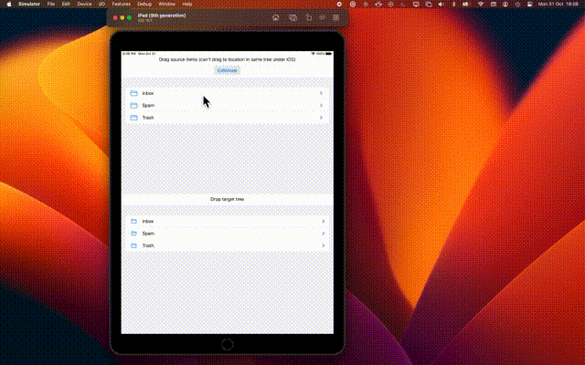

##  Intro

This is a second experiment at creating a viable Drag and Drop (D&D) editable, tree like list view using 100% current SwiftUI components on macOS.

**TL;DR; Doesn't quite work because of what looks like a bug on `macOS` that prevents dragging of the `List` selection with multiple items **

(If interested, the first attempt is over on the branch `list_and_onMove_based`)

In a similar way to the first attempt, the app mocks the UI of a simple Mail program. Where the goal of the app is to allow the user to conveniently navigate and rearrange a potentially large number of hierarchically related items.

To do this the implementation needs to realise:
	
1. The tree as collapsible nodes made up of mail folders and with their content being child items (in order to make efficient use of screen estate).
2. Drag and drop movement of multiple mail and folder items between folders.
2. Auto-expansion and closure of parent folder node (to allow the user to explore for target locations while dragging  operations are underway).

*Why*

*On macOS, this type of tree view is a convenient and widely used UI paradigm e.g. Finder's View -> 'as List' view. So  it would be nice to have something that worked well enough to use in macOS apps without having to resort to 
`NSViewRepresentable`*

The problem is that for SwiftUI, as of macOS 13 & Xcode 14.1, the standard shipped `List` component allows  **either**:

- *A flat, non-hierarchical `List` with multiple items easily movable with in it via the `onMove` modifier.* 
- *Or a a hierarchical tree `List` but with unmovable items using* 

**But not both at the same time**

## Building, running and testing

The project's been built using  Xcode 14.1  and runs on macOS 13 (for comparative testing it'll also build and run for `iPadOS`)

*Aside: To the best of knowledge, there is nothing in the code that means it should not work with earlier versions. But it has not been tested on those*

When run the app should load some test data and allow the user to:
- Drag and Drop re-arrange selections of Folders and mock mail items anywhere within the tree apart from the root.
- Auto expand closed folders when the user is dragging and close them again after the dragging operation completes.

And  that's it. There is nothing to create new mail or folder items, convert items backward and forwards between Folder and Mail types, change sorting order, allow items to be in multiple parent folders etc. 

Testing - There are no automated tests. Just build and run the app to see what it does.

## Implementation
### Models
The app makes use of the following `ObservableObject` model classes.

- `Items` - models raw business data in the system. Things like: 
	-  its title. 
	-  If the item is a parent (aka folder) item, any children (aka mail items associated with it),  
	
- `AppModel` - models application level business logic. For instance, in the demo app it provides the canonical list of Items and methods to load the test data.

### Layout
The app uses its own recursive algorithm  to lay out the hierarchical structure using `DisclosureGroup`s.  

It uses `DisclosureGroup` because that component provides api for the programatic expansion and collapse of folder nodes.

### Drag & Drop
- The dragging process is triggered through the use of the `onDrag` modifier that is attached to both parent folder and child Items. The item that is being dragged has its `id` encoded as text Universal Type Identifier via `NSItemProvider`.
- Movement of the dragged items to:
	- Target folders uses the `onDrop` modifier to recognise when the items have been dropped on a target folder.
	- `onInsert` to recognise when items have been dropped between both folders and ordinary items.

In both `onDrop` and `onInsert`;  `NSItemProvider.loadObject` is used to determine what has been dropped/inserted and to trigger its movement to the appropriate parent folder.

### Folder auto-expansion and collapse when dragging
This built-in on `macOS` as part of `onInsert` mechanism. 
 
## Bugs and missing functionality

### `onDrag` Cannot drag `List`'s highlighted `selection`

- Only able to grab and drag individual items.  
	- Works correctly on iPadOS (as shown below), which implies SwiftUI bug on macOS. 
	- Work-around 
		-  Encode the `List`'s `selection` (as opposed to the individual item) in the `onDrag` that gets triggered.
		-  However, work-around does not give preview drag animations, so left as is.

### Unable to add `onTapGesture` gesture to `List`'s highlighted selection

- Have to tap on the actual text to trigger.
- Possible bug, on `iPadOS` if `List` used with no `selection` then built in clicking anywhere in row expands. However, if `selection` used, then lose default expansion and have to click on text to trigger gesture.

### Auto-expansion and collapse on iPad.

Not really focus of experiment; but worth mentioning that auto expansion doesn't work when `onDrop` is used at the same time with `onInsert`. Not sure if it's a bug, or it's a `iOS` platform limitation. 

 
### Previous vs this version comparisons

| Functional  | Previous version (`list_and_onMove_based`) |  Current  (`main`)|
|:--          |:--                            |:--       |
| **Functional** | | |
| Item move | ✅ | ✅ |
| Folder movement | ✅ | ✅ |
| Folder auto expand | ❌ | ✅  |
| Folder auto collapse | ❌ | ✅ |
| **Implementation** | | |
| Custom indented `List` with `onMove`  | ✅ | |
| `List` with `DisclosureGroup`, `onDrag`, `onDrop` and `onInsert`

## Misc
### Branches

1. `list_and_onMove_based` - First attempt at solution based on `List` with custom indentation.
2. `autoExpandingDisclosureGroupStyle` - Attempt at solution based on using `List`'s  built-in outline group rendering with a   `DisclosureGroupStyle` to handle `onDrop`. Works quite nicely, but unable to use with `onInsert` to trigger auto expansion of folders. On balance.
3. `autoExpangindBuiltInMech` -> current dev branch for `main`

